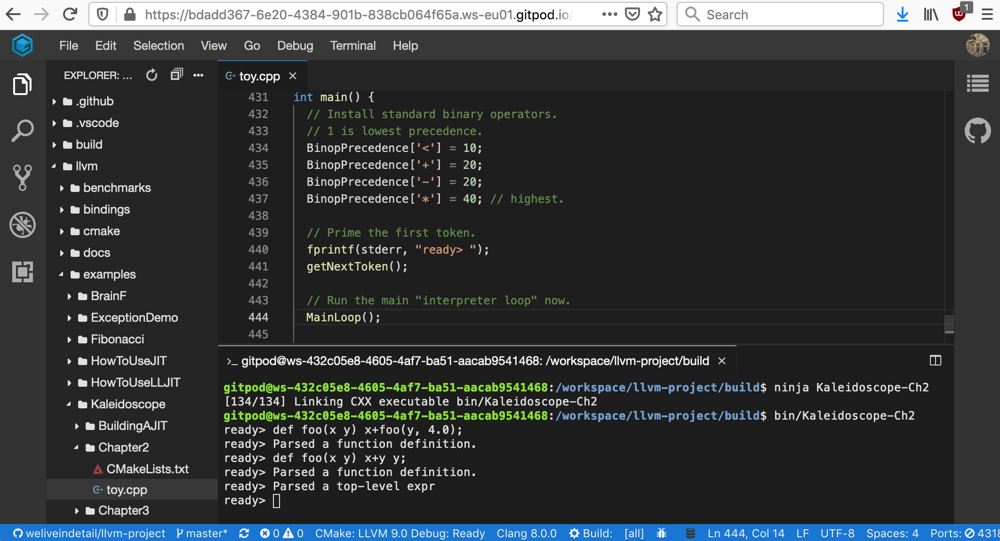

# Gitpod support for LLVM examples

## Kaleidoscope: My First Language Frontend with LLVM

Documentation: http://llvm.org/docs/tutorial/MyFirstLanguageFrontend/index.html

| Chapter | GitPod | Description |
| ------- | ------ | ----------- |
| 1 |   | [Kaleidoscope language and Lexer](http://llvm.org/docs/tutorial/MyFirstLanguageFrontend/LangImpl01.html) |
| 2 |   | [Implementing a Parser and AST](http://llvm.org/docs/tutorial/MyFirstLanguageFrontend/LangImpl02.html) |
| 3 |   | [Code generation to LLVM IR](http://llvm.org/docs/tutorial/MyFirstLanguageFrontend/LangImpl03.html) |
| 4 |   | [Adding JIT and Optimizer Support](http://llvm.org/docs/tutorial/MyFirstLanguageFrontend/LangImpl04.html) |
| 5 |   | [Extending the Language: Control Flow](http://llvm.org/docs/tutorial/MyFirstLanguageFrontend/LangImpl05.html) |
| 6 |   | [Extending the Language: User-defined Operators](http://llvm.org/docs/tutorial/MyFirstLanguageFrontend/LangImpl06.html) |
| 7 |   | [Extending the Language: Mutable Variables](http://llvm.org/docs/tutorial/MyFirstLanguageFrontend/LangImpl07.html) |
| 8 |   | [Compiling to Object Files](http://llvm.org/docs/tutorial/MyFirstLanguageFrontend/LangImpl08.html) |
| 9 |   | [Debug Information](http://llvm.org/docs/tutorial/MyFirstLanguageFrontend/LangImpl09.html) |

## Status

* Native debugging support in Gitpod is still under development 
https://github.com/gitpod-io/gitpod/issues/544#issuecomment-552363753
